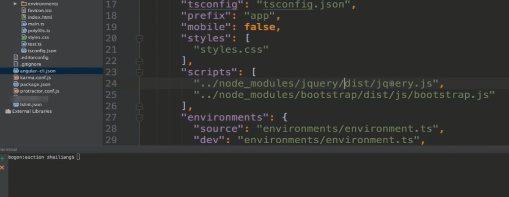

<h1> Set Environment</h1>
<h2>Install NodeJS and Angular CLI</h2>
1.Download NodeJs from https://nodejs.org/en/ 
This project I use Window system, So I downloaded Window Installer
2.Open NodeJS command Prompt for installing AngularJs CLI
 Input command for installing CLI
 <code>npm install -g @angular/cli</code> 
 <h2>Install WebStorm </h2>
 I download WebStorm for this project
 https://www.jetbrains.com/webstorm/
 <h2> Frequently used commands</h2>
 Create project 
 <code> ng new ProjectName</code> 
 Create component 
 <code>ng g component componentName</code> 
 Install third part service like JQuery 
 1.nodeJS command 
 <code>npm install jquery --save</code> 
 2.add reference into angularJs-cli.json file 
 
 2.Typescript of Jquery 
 <code>npm install @types/jquery --save--dev</code> 
 

